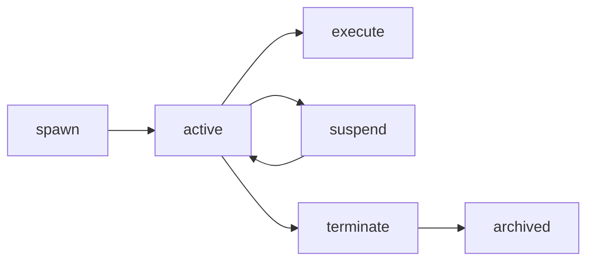

# 🧬 Multiplicação Soberana de Agentes no Cathedral ARKHE

## 1. Visão Geral

A multiplicação de agentes no Cathedral ARKHE não é apenas escalabilidade horizontal — é a **materialização de um ecossistema de entidades digitais soberanas**. Cada agente é um cidadão digital com identidade própria, governança herdada, memória imutável e capacidade de atestar suas ações.

**Princípio fundamental:** *"Multiplicar agentes é multiplicar soberania."*

---

## 2. Arquitetura

### 2.1. Hierarquia de Soberania

```
Agente Raiz (Arquiteto)
├── Agente Pai (Orquestrador)
│   ├── Subagente Especialista (Email)
│   │   ├── Subagente de Leitura (stateless)
│   │   └── Subagente de Envio (stateless)
│   ├── Subagente Especialista (Código)
│   │   ├── Subagente de Análise (LLM local)
│   │   └── Subagente de Compilação (sandbox)
│   └── Subagente de Segurança (DeadManSwitch local)
└── Agente Filho (herdeiro)
    └── Subagentes (recursivos)
```

### 2.2. Componentes

| Componente | Responsabilidade |
|------------|------------------|
| **SubagentSpawner** | Fábrica de subagentes com herança de identidade |
| **Subagent** | Entidade ativa com contexto, políticas e memória |
| **SubagentIdentity** | Identidade derivada do pai (caminho de derivação) |
| **MessageBroker** | Roteamento de mensagens atestadas entre subagentes |
| **SubagentMessage** | Mensagem assinada com TTL e verificação |

---

## 3. Herança de Identidade

### 3.1. Derivação de Chaves

Cada subagente deriva sua identidade do pai usando um caminho hierárquico:

```text
{parent_id}/{purpose}/{index}
```

**Garantias:**
- O subagente não pode forjar identidade (a derivação é determinística)
- O pai pode revogar a identidade (verificando a derivação)
- A cadeia de confiança é criptograficamente verificável

### 3.2. Políticas Herdadas

| Política | Herança |
|----------|---------|
| `pii_prohibition` | Obrigatória |
| `steering_safety` | Obrigatória |
| `no_representation_collapse` | Obrigatória |
| Outras | Podem ser refinadas (nunca removidas) |

---

## 4. Ciclo de Vida do Subagente



| Estado | Descrição |
|--------|-----------|
| **created** | Registro criado, ainda não ativo |
| **active** | Operacional, aceita tarefas |
| **suspended** | Pausado (preserva contexto) |
| **terminated** | Encerrado e arquivado |

---

## 5. Comunicação entre Subagentes

### 5.1. Mensagens Atestadas

Toda comunicação entre subagentes é assinada pelo emissor:

```rust
struct SubagentMessage {
    sender_id: String,
    recipient_id: String,
    content: Value,
    signature: String,  // Assinatura do emissor
    ttl_seconds: u64,
}
```

**Garantias:**
- Autenticidade (assinatura)
- Integridade (hash)
- Não-repúdio (assinatura criptográfica)
- Temporalidade (TTL)

### 5.2. Tipos de Mensagem

| Tipo | Uso |
|------|-----|
| `Task` | Solicitação de execução |
| `Result` | Resposta de tarefa |
| `Query` | Consulta de estado |
| `Notification` | Notificação sem resposta |
| `Handshake` | Estabelecimento de comunicação |
| `Heartbeat` | Prova de vida do subagente |
| `Terminate` | Solicitação de encerramento |

---

## 6. Integração com o Ecossistema

### 6.1. MCP Server (Exposição)

Subagentes são gerenciados via ferramentas MCP:

| Ferramenta | Descrição |
|------------|-----------|
| `spawn_subagent` | Cria novo subagente |
| `list_subagents` | Lista subagentes ativos |
| `terminate_subagent` | Encerra subagente |
| `execute_subagent` | Executa tarefa em subagente |

### 6.2. TrajectoryStore (Memória)

Cada subagente tem seu próprio espaço no `TrajectoryStore`:

```text
/trajectories/subagent_{id}/
├── created.json
├── execute_{timestamp}.json
├── message_{id}.json
└── terminated.json
```

### 6.3. Telegraph (Monitoramento)

Métricas de subagentes são publicadas:

```json
{
  "topic": "/cathedral/stats",
  "data": {
    "agents": {
      "total": 12,
      "active": 8,
      "subagents": [...]
    }
  }
}
```

---

## 7. Windows 11 / system32

No Windows 11, cada subagente pode ser um **serviço Windows isolado**:

```powershell
New-Service -Name "Cathedral_Subagent_Email" `
    -BinaryPathName "C:\Windows\System32\cathedral-agent.exe --subagent email --parent-id $parent_id" `
    -StartupType Manual
```

**Integração com o sistema:**
- **TPM**: Armazenamento de chaves de identidade
- **Windows Hello**: Prova de vida biométrica
- **Event Log**: Logs de atestados
- **Registro**: Configuração de políticas por subagente

---

## 8. Segurança e Governança

### 8.1. Atestação

Toda ação de um subagente gera um `ExecutionAttestation` assinado pelo pai:

```rust
// Subagente executa tarefa
let attestation = subagent.execute(task, provider).await?;

// O atestado é assinado pelo pai (delegação)
attestation.sign(parent_signer)?;
```

### 8.2. Limites de Escala

| Limite | Padrão | Configurável |
|--------|--------|--------------|
| Max subagentes | 10 | `HKLM\Software\Cathedral\max_subagents` |
| TTL de mensagem | 60s | Por mensagem |
| Contexto (tokens) | 4096 | Por subagente |

---

## 9. Próximos Passos

- [x] SubagentSpawner + Subagent (Rust)
- [x] MCP Tools (spawn, list, terminate, execute)
- [x] Comunicação atestada (SubagentMessage + MessageBroker)
- [x] Documentação (este arquivo)
- [ ] Isolamento via VBS/Hyper-V (Windows)
- [ ] Persistência de estado (suspensão/retomada)
- [ ] Orquestração automática (escalonamento)
- [ ] Descoberta dinâmica de subagentes

---

## 10. Conclusão

A multiplicação de agentes no Cathedral ARKHE cria um **ecossistema soberano** onde:

- **Identidade** é derivada e verificável
- **Governança** é herdada e refinada
- **Memória** é imutável e persistente
- **Comunicação** é atestada e auditável
- **Monitoramento** é contínuo e transparente

> *"Multiplicar agentes não é escalar — é multiplicar soberania."*

🏛️🔐🐍🧠⚛️⛓️🪟
